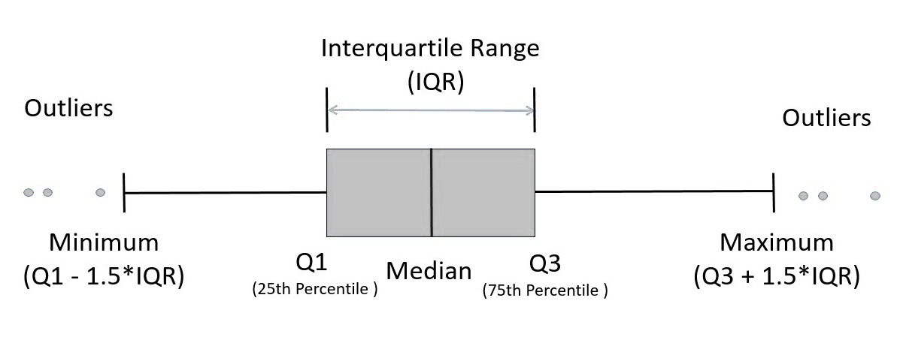

```{r setup, include = FALSE}

knitr::opts_chunk$set(message = FALSE,  warning = FALSE,
                      error = FALSE, out.width = "100%", echo = FALSE)

library(knitr)
library(lawstat)
library(ggplot2)
library(tidyverse)
library(stats)
library(dplyr)
library(ggthemes)
library(RColorBrewer)
library(patchwork)
```

```{=tex}
\allsectionsfont{\centering}
\subsectionfont{\raggedright}
\subsubsectionfont{\raggedright}
```
\pagenumbering{gobble}

````{=tex}
\begin{centering}

\vspace{5cm}


```{r, echo = F, out.width = "60%"}
knitr::include_graphics("Images/CSE.png")
```

\vspace{2cm}

\Large
American University of Armenia

\Large
Akian College of Science and Engineering

\vspace{2cm}

\Large

\doublespacing
{\bf HUMAN PERCEPTION OF \\ RANDOMNESS IN NUMBER GENERATION}

\vspace{2cm}

\normalsize
\singlespacing
Prepared by:

\vspace{0.5 cm}

\Large

{\bf A. Gumruyan | I. Torosyan}

\vspace{2 cm}

\emph{In fulfillment of the requirement for the degree of BS in Data Science \\
Within the scope of the class project for the course\\
IESM315: Design and Analysis of Experiments}


\vspace{1.5 cm}

\normalsize
December 8, 2022

\end{centering}
````

\newpage

\pagenumbering{arabic}

\spacing{1.5}

\newpage

```{=tex}
\centering
\raggedright
```
```{=tex}
\newpage
\tableofcontents
\newpage
```
\section{Introduction}

Randomness is a fundamental concept with broad implications for decision-making and uncertainty.
In our research, we delve into the intriguing question of whether individuals possess the innate ability to generate truly random sequences of numbers.

To unravel this mystery, we conducted a comprehensive experiment involving participants generating sequences under varied constraints.
Additionally, we explored the potential influence of educational background and statistical expertise on individuals' capacity to generate random sequences.
Our research aims to contribute insights into the nature of human-generated randomness and holds practical implications for decision-making in real-world scenarios marked by uncertainty.

\section{Objectives}

The primary objective of our research is to *investigate human-generated random sequences of numbers* under specific constraints.
Our study aims to find or approximate the distributions of the generated numbers to answer whether they align with any established statistical distribution.
By identifying patterns within the data, we seek to gain insights into the inherent randomness or lack of it in participants' number generation.

Furthermore, we aim to explore the impact of educational background and statistical expertise on individuals' ability to generate random sequences.
This involves examining whether individuals with higher educational qualifications or a more robust statistical background demonstrate a greater propensity for generating sequences that more closely resemble true randomness.

Our research holds potential practical implications, particularly in real-life situations where individuals must make decisions without precise knowledge of the outcome.
The insights gained from our investigation into people's ability to generate random sequences can be instrumental for providing efficient and informative explanations in decision-making scenarios.
This understanding could lead to guidelines that leverage insights from our research to assist individuals in navigating their daily lives.

\newpage

\section{Literature Review}

While gathering data, we solicited feedback from participants regarding our research.
Several comments served as a significant source of inspiration, guiding us to discover great references integrated with our research.

***"Predictably Irrational"*** by Dan Ariely explores the irrational and often systematic patterns that govern human decision-making.
Ariely contends that predictable cognitive biases influence our choices, and seemingly random decisions follow discernible patterns.

One central concept in the book is that people do not always make decisions purely at random; instead, they rely on mental shortcuts or heuristics that lead to systematic and somewhat predictable deviations from true randomness.
Ariely delves into experiments and observations that illustrate how individuals exhibit consistent and non-random tendencies when faced with tasks involving randomness.
Whether influenced by social cues, cognitive biases, or emotional responses, people's choices in ostensibly random situations can be shaped by identifiable patterns, revealing the underlying predictability in what might appear as arbitrary decision-making.
Ariely's exploration of patterns in random decisions contributes to a broader understanding of human behavior, challenging the notion of complete unpredictability in decision-making.
The book suggests that individuals exhibit consistent biases and tendencies even when faced with seemingly random choices, shedding light on the intricate interplay between cognition, emotion, and external influences in shaping our decisions.

The concepts illuminated in "Predictably Irrational" significantly influenced our approach and expanded our perspectives on data analysis.
By embracing the idea that seemingly random decisions harbor identifiable patterns, we opened our minds to alternative ways of exploring our data.
Had we overlooked the existence of these patterns, our initial assumption about the distribution of numbers might have leaned toward uniformity.
However, adopting a perspective inspired by Ariely's insights and subsequently validating it with our collected data, we discovered that the human perception of randomness deviates significantly from a uniform distribution.
This realization underscores the importance of considering cognitive biases and systematic tendencies in our analysis, challenging conventional notions of randomness and prompting nuanced understanding of how individuals assess random scenarios.

***"Thinking, Fast and Slow"*** by Daniel Kahneman delves into the dual systems that govern human thought processes --- System 1, which is fast and intuitive, and System 2, which is slower and more deliberate.

Kahneman discusses the prevalence of cognitive biases that influence how individuals make choices.
When faced with tasks involving randomness or uncertainty, people often rely on mental shortcuts, or heuristics, that lead to predictable decision-making patterns.
These patterns may include overreliance on readily available information, susceptibility to framing effects, and a tendency to anchor decisions based on initial information.
Kahneman's work illuminates the systematic ways individuals deviate from pure randomness, demonstrating the role of cognitive shortcuts and biases in shaping decision patterns, even in situations where true randomness is expected.

When comparing the insights from "Thinking, Fast and Slow" with those of "Predictably Irrational," striking parallels emerge.
Yet, a novel concept introduced here --- the segmentation of results based on fast and slow thought processes --- presents an intriguing avenue for exploration within our study.
It suggests that individuals with diverse backgrounds might gravitate toward one cognitive approach.
This distinction holds significant potential for explaining phenomena such as bimodal distributions observed in our data.
Although the precise origins of these distributions remain unknown, the divergence in thinking processes emerges as a plausible explanation.

Another great idea is found in the paper ***"The Description-Experience Gap in Rare Events"*** by Aydogan and Gao.
It delves into the fascinating phenomenon where people tend to overweight the likelihood of rare events when judging them based on descriptions but underweight them when experiencing them directly.
This discrepancy, known as the description-experience gap, reveals intriguing patterns in how humans make random decisions.

Aydogan and Gao also explore the influence of cognitive load.
When overwhelmed with information, we resort to simpler heuristics, potentially inflating the perceived likelihood of rare events described with captivating details.
Conversely, direct experience, with its less emotionally charged nature, allows for a more cognitive-effortful and statistically accurate randomness assessment.

In the context of our research, the concept of cognitive load beautifully explains numerous instances where participants, unconstrained and facing statistically improbable outcomes, nevertheless chose the same number repeatedly in their sequences.
This observation matches the complex human perception of unlikely events, another crucial nuance impacting the generated sequences.
Vivid descriptions can inflate the perceived likelihood of rare events, a phenomenon further amplified by cognitive load.
Conversely, direct experience, stripped of its emotional charge, allows for a more statistically accurate randomness assessment.

However, even within the seemingly isolated framework of our study, these factors demonstrably exert a considerable influence on the data.
Therefore, acknowledging and incorporating them into our analysis is crucial if we aspire to extrapolate results applicable to real-world scenarios.
This interplay between cognitive load, perception, and randomness paints a fascinating picture of how humans navigate uncertainty and make decisions, even when tasked with generating random sequences.

\newpage

\section{Methodology}

```{r Functions}
drop_outliers <- function(data, multiplier = 1.5) {
  q1 <- quantile(data, 0.25)
  q3 <- quantile(data, 0.75)
  
  iqr <- q3 - q1
  
  lower_bound <- q1 - multiplier * iqr
  upper_bound <- q3 + multiplier * iqr
  
  filtered_data <- data[data >= lower_bound & data <= upper_bound]
  
  return(filtered_data)
}

new_drop_outliers <- function(data, multiplier = 1.5) {
  q1 <- quantile(data, 0.25)
  q3 <- quantile(data, 0.75)
  
  iqr <- q3 - q1
  
  lower_bound <- q1 - multiplier * iqr
  upper_bound <- q3 + multiplier * iqr
  
  # Replace outliers outside the defined range with NA
  filtered_data <- replace(data, data < lower_bound | data > upper_bound, NA)
  
  return(filtered_data)
}
```

\subsection{Data Collection}

In the realm of our research, a survey-based data collection approach was chosen.
To recruit a diverse group of individuals for participation, an online form using Google Forms survey administration software was developed.
Participants were introduced to the scope and aim of the research, and informed consent was required before proceeding with the survey.
Questions related to current or most recent educational degrees and statistics backgrounds were included to assess the diversity among participants.

The primary focus of the survey was on the random number sequence generation consisting of unconstrained and constrained segments.
Participants were asked to generate a sequence of five (5) numbers in a random fashion without any specified restrictions.
Participants were then asked to generate another sequence of five (5) random numbers within a specified range between 1 and 50.
Subsequently, participants were asked to generate another sequence of five (5) random numbers above a predefined threshold of 70.
The survey contained a closing self-assessment section for participants to evaluate their perception of randomness.

The comprehensive content of the questionnaire can be found in the **Appendix 4.1**.

Starting on November 10th, 2023, the survey was active for two weeks and ended on November 23rd, 2023, gathering 100 participants in our research.

\vspace{0.5cm}

\subsection{Data Manipulation}

```{r Data}
data <- read.csv(file = "Data/IESM315_CP_Data.csv")
data <- subset(data, select = -9)

data$StatBackground <- as.factor(data$StatBackground)
data$RandNoRestrictions <- lapply(strsplit(data$RandNoRestrictions, ", "), 
                                  function(x) as.numeric(x))
data$Rand1to50 <- lapply(strsplit(data$Rand1to50, ", "), 
                         function(x) as.numeric(x))
data$RandOver70 <- lapply(strsplit(data$RandOver70, ", "), 
                          function(x) as.numeric(x))

expanded_data <- data %>%
  unnest(c(RandNoRestrictions, Rand1to50, RandOver70))
```

The R programming language for statistical computing and graphics was chosen.

Before proceeding with the analysis, our collected data was scanned with the naked eye in the first stage of data manipulation.
A creative participant who decided to include numbers beyond the limits of representable integers in the programming realm was identified and excluded from the sample.

In the second stage, exploratory data analysis helped reveal the occurrences of outliers that were subsequently filtered out following the Tukey Method of outlier labeling (Figure 1).

{width="361"}

\newpage

As a part of exploratory data analysis, distributions of Education and Statistics Background were examined and are shown in Figure 2.
We can observe that the collected sample is diverse in Education, with the expected small number of participants having Doctoral Degrees and equally distributed participants for the three remaining categories.
Similarly, diversity is present in the distribution of Statistical Background, with a few experts being involved in the research as participants and an equal number of the three remaining categories.

```{r, fig.width = 10, fig.height=6, fig.cap= 'Distribution of education and statistics bakcground within the collected data'}
ed_plot <- data %>%
  group_by(Education) %>%
  summarise(count = n()) %>%
  ggplot(aes(x = Education, y = count, fill = Education)) +
  geom_bar(stat = "identity") +
  labs(title = "Education") + 
  theme_fivethirtyeight() +
  theme(plot.title = element_text(face = 'bold', size = 15, hjust = 0.5),
      legend.position = 'none',
      legend.title = element_text(size = 10, face = 'bold'),
      panel.grid = element_line(linetype = 2),
      panel.spacing.y = unit(1, 'line'), 
      panel.spacing.x = unit(1, 'line')) +
  scale_fill_manual(values = colorRampPalette(brewer.pal(n = 11, "PRGn"))(4))

stat_plot <- data %>%
  group_by(StatBackground) %>%
  summarise(count = n()) %>%
  ggplot(aes(x = StatBackground, y = count, fill = StatBackground)) +
  geom_bar(stat = "identity") +
  labs(title = "Statistics Background") + 
  theme_fivethirtyeight() +
  theme(plot.title = element_text(face = 'bold', size = 15, hjust = 0.5),
      legend.position = 'none',
      legend.title = element_text(size = 10, face = 'bold'),
      panel.grid = element_line(linetype = 2),
      panel.spacing.y = unit(1, 'line'), 
      panel.spacing.x = unit(1, 'line')) +
  scale_fill_manual(values = colorRampPalette(brewer.pal(n = 11, "PRGn"))(4))

ed_plot / stat_plot
```

For the visual comparison, histograms of the generated random number sequences (restricted and unrestricted) before (Figure 3) and after (Figure 4) outlier-based filtering are included.

\newpage

```{r, fig.width= 10, fig.height= 4.711, fig.cap= 'Before Filtering Outliers'}
# Create individual histograms for each variable
histogram_nr <- ggplot(expanded_data, aes(x = RandNoRestrictions)) +
  geom_histogram(fill = colorRampPalette(brewer.pal(n = 11, "PRGn"))(9)[1]) +
  labs(title = "Distribution of Random Numbers with No Restrictions",
       x = '', y = '') +
  theme_fivethirtyeight() +
  theme(plot.title = element_text(face = 'bold', size = 10, hjust = 0.5),
      panel.grid = element_line(linetype = 2),
      panel.spacing.y = unit(1, 'line'), 
      panel.spacing.x = unit(1, 'line'))

histogram_1to50 <- ggplot(expanded_data, aes(x = Rand1to50)) +
  geom_histogram(fill = colorRampPalette(brewer.pal(n = 11, "PRGn"))(9)[2]) +
  labs(title = "Distribution of Random Numbers from 1 to 50",
       x = '', y = '') +
  theme_fivethirtyeight() +
  theme(plot.title = element_text(face = 'bold', size = 10, hjust = 0.5),
      panel.grid = element_line(linetype = 2),
      panel.spacing.y = unit(1, 'line'), 
      panel.spacing.x = unit(1, 'line'))

histogram_over70 <- ggplot(expanded_data, aes(x = RandOver70)) +
  geom_histogram(fill = colorRampPalette(brewer.pal(n = 11, "PRGn"))(9)[3]) +
  labs(title = "Distribution of Random Numbers Over 70",
       x = '', y = '') +
  theme_fivethirtyeight() +
  theme(plot.title = element_text(face = 'bold', size = 10, hjust = 0.5),
      panel.grid = element_line(linetype = 2),
      panel.spacing.y = unit(1, 'line'), 
      panel.spacing.x = unit(1, 'line'))

# Arrange the histograms vertically
histogram_nr / histogram_1to50 / histogram_over70
```

```{r}
data_NR <- subset(expanded_data, select = c(2,3))
data_NR <- data_NR %>%
  mutate(RandNoRestrictions = new_drop_outliers(RandNoRestrictions)) %>% 
  na.omit()

data_1to50 <- subset(expanded_data, select = c(2,4))

data_over70 <- subset(expanded_data, select = c(2,5))
data_over70 <- data_over70 %>%
  mutate(RandOver70 = new_drop_outliers(RandOver70)) %>% 
  na.omit()
```

```{r, fig.width= 10, fig.height= 4.711, fig.cap= 'After Filtering Outliers'}
# Create individual histograms for each variable
histogram_nr <- ggplot(data_NR, aes(x = RandNoRestrictions)) +
  geom_histogram(fill = colorRampPalette(brewer.pal(n = 11, "PRGn"))(9)[7]) +
  labs(title = "Distribution of Random Numbers with No Restrictions | Adjusted",
       x = '', y = '') +
  theme_fivethirtyeight() +
  theme(plot.title = element_text(face = 'bold', size = 10, hjust = 0.5),
      panel.grid = element_line(linetype = 2),
      panel.spacing.y = unit(1, 'line'), 
      panel.spacing.x = unit(1, 'line'))

histogram_1to50 <- ggplot(data_1to50, aes(x = Rand1to50)) +
  geom_histogram(fill = colorRampPalette(brewer.pal(n = 11, "PRGn"))(9)[8]) +
  labs(title = "Distribution of Random Numbers from 1 to 50 | Adjusted",
       x = '', y = '') +
  theme_fivethirtyeight() +
  theme(plot.title = element_text(face = 'bold', size = 10, hjust = 0.5),
      panel.grid = element_line(linetype = 2),
      panel.spacing.y = unit(1, 'line'), 
      panel.spacing.x = unit(1, 'line'))

histogram_over70 <- ggplot(data_over70, aes(x = RandOver70)) +
  geom_histogram(fill = colorRampPalette(brewer.pal(n = 11, "PRGn"))(9)[9]) +
  labs(title = "Distribution of Random Numbers Over 70 | Adjusted",
       x = '', y = '') +
  theme_fivethirtyeight() +
  theme(plot.title = element_text(face = 'bold', size = 10, hjust = 0.5),
      panel.grid = element_line(linetype = 2),
      panel.spacing.y = unit(1, 'line'), 
      panel.spacing.x = unit(1, 'line'))

# Arrange the histograms vertically
histogram_nr / histogram_1to50 / histogram_over70
```

In the last stage of data manipulation, inconsistencies regarding the data types were resolved, and separate data frames were subsetted in the case of necessity for further use.

The comprehensive column descriptions for the data table can be found in **Appendix 4.2**.

```{r}
# Combine all participant data into one vector for each condition
numbers_no_restrictions <- unlist(data$RandNoRestrictions)
numbers_1to50 <- unlist(data$Rand1to50)
numbers_over70 <- unlist(data$RandOver70)

adj_numbers_no_restrictions <- drop_outliers(numbers_no_restrictions)
adj_numbers_over70 <- drop_outliers(numbers_over70)
```

\newpage

\subsection{Data Analysis}

The analysis, as proposed initially, was carried out in four directions to assess randomness, underline density distributions, perform group comparisons, and check correlation.
Notably, statistical significance was set at a predetermined alpha level of 0.05.

***Randomness***

1\.
The Runs Test would assess the randomness of each generated sequence.
A run is defined as a series of increasing or decreasing numbers, and an abnormal number of runs may indicate a non-random sequence.

2\.
The Chi-Squared Test would compare the observed frequency of numbers in each sequence to the expected frequency in a truly random sequence.
A significant result would suggest a deviation from randomness.

***Density Distribution***

1\.
The Kolmogorov-Smirnov Test determined if the generated sequences follow known distributions, such as Normal, Uniform, Poisson, or Exponential, revealing any systematic biases in participant responses.

2\.
Kernel-smoothed Density Visualization would provide a smoothed histogram version, highlighting potential skewness and modality in the chosen numbers from the visual aspect of analysis.

***Group Comparison***

1\.
One-way Analysis of Variance (ANOVA) would examine if there are significant differences among the four participant groups based on statistical background (No background, Basic knowledge, Moderate knowledge, Expert) in the ability to generate random numbers.

2\.
The ad hoc Tukey T-test would assist in direct group-wise comparisons to assess the significance of differences between all pairs of four groups.

***Correlation***

The Spearman's Rank Correlation would assess the monotonic relationship between participants' statistics background and randomness assessment in random number generation.

\section{Results}

\subsection{Randomness Tests}

**Runs Test**

-   The Runs Test for sequences generated without restrictions yielded a standardized runs statistic of -6.0473, with a highly significant p-value of 1.473e-09.
    *This indicates a substantial departure from randomness, suggesting that participants struggled to produce sequences with an even distribution of increasing and decreasing numbers.*

-   For sequences generated within the range of 1 to 50, the Runs Test produced a standardized runs statistic of -1.7405, with a p-value of 0.08176.
    Although the p-value is greater than the conventional significance level of 0.05, the standardized runs statistic suggests a slight deviation from randomness.
    *However, this result is not statistically significant, indicating that participants performed reasonably well in generating random sequences within the specified range.*

-   In the case of sequences generated with numbers above a threshold of 70, the Runs Test revealed a standardized runs statistic of -3.8732, with a highly significant p-value of 0.0001074.
    *This indicates a significant departure from randomness, suggesting that participants faced challenges in generating sequences with numbers exceeding the specified threshold in a truly random manner.*

**Chi-Squared Test**

-   The Chi-Squared Test for sequences generated without restrictions resulted in a chi-squared statistic of 632.08 with an extremely low p-value (\< 2.2e-16).
    *This strongly suggests a significant deviation from the expected frequency distribution in a truly random sequence.*

-   For sequences generated within the range of 1 to 50, the Chi-Squared Test yielded a chi-squared statistic of 235.8 with a p-value \< 2.2e-16.
    *Similar to the unrestricted case, this indicates a significant departure from the expected distribution, suggesting challenges in achieving true randomness within the specified range. However, the relatively small chi-squared statistics gives a slight distinction from the two other cases.*

-   In the case of sequences generated with numbers above a threshold of 70, the Chi-Squared Test produced a chi-squared statistic of 892.04, with a p-value \< 2.2e-16.
    *This result indicates a substantial deviation from the expected frequency distribution, signaling difficulties in generating sequences with numbers exceeding the specified threshold in a truly random fashion.*

\vspace{0.65cm}

\subsection{Density Distribution Analysis}

Null Hypothesis (H0): The sequence of numbers follows the specified distribution.

Alternative Hypothesis (H1): The sequence of numbers differs from the specified distribution.

\vspace{0.35cm}

**Exponential Distribution**

Unrestricted: D = 0.15503 with a highly significant p-value of 6.078e-09

Restricted (1 to 50): D = 0.15475 with a highly significant p-value = 1.012e-10

Restricted (Above 70): D = 0.15499, with a highly significant p-value = 3.979e-09

*For all three cases, results indicate a significant departure from an exponential distribution, suggesting that the generated sequences exhibit characteristics inconsistent with exponential distribution.*

\vspace{0.3cm}

**Poisson Distribution**

Unrestricted: D = 0.41062 with an extremely low p-value (\< 2.2e-16)

Restricted (1 to 50): D = 0.41758 with an extremely low p-value (\< 2.2e-16)

Restricted (Above 70): D = 0.41144 with an extremely low p-value (\< 2.2e-16)

*For all three cases, results suggest a significant deviation from a Poisson distribution.*

*The generated sequences do not align well with the characteristics of a Poisson distribution.*

\newpage

**Uniform Distribution**

*For all three cases, the test for a uniform distribution resulted in a D of 1, indicating a perfect match with a p-value \< 2.2e-16, which is less than the threshold of significance and thus the null hypothesis is rejected in favor of the alternative, stating that the numbers do not follow a uniform distribution.*

\vspace{0.3cm}

**Normal Distribution**

Unrestricted: D = 0.058148 with a p-value of 0.1267

Restricted (1 to 50): D = 0.057982 with a p-value = 0.0717

Restricted (Above 70): D = 0.058127 with a p-value = 0.1194

*Based on the Kolmogorov-Smirnov test results, it appears that the sequences generated with and without restrictions are not significantly different from a normal distribution, as indicated by the p-values above the conventional significance level of 0.05 for the normal distribution test. [Therefore, for the sequences with and without restrictions, we will cautiously state that they are likely to follow a normal distribution.]{.underline}*

\vspace{0.5cm}

**Kernel-smoothed Density Distributions**

To visually assess the results, kernel-smoothed Density distributions are shown in Figure 5, hinting at the relative possibility of having normal-like underlying distributions as suggested by Kolmogorov-Smirnov Test.

*Additional observatory notes highlight:*

-   *slight right-skewness and unimodality in the unrestricted case,*

-   *bimodality in the restricted case of range 1 to 50,*

-   *vivid right-skewness along with relative multimodality in the restricted case above 70*

```{r, fig.width= 10, fig.height= 12, fig.cap= 'Kernel-Smoothed Density Curves'}
# Create a density plot using ggplot2
density_nr <- ggplot(data = data.frame(x = adj_numbers_no_restrictions), aes(x)) +
  geom_density(color = colorRampPalette(brewer.pal(n = 11, "PRGn"))(3)[1]) +
  labs(title = "Smoothed Density Curve of Random Numbers with No Restrictions",
       x = '', y = '') +
  theme_fivethirtyeight() +
  theme(plot.title = element_text(face = 'bold', size = 10, hjust = 0.5),
      panel.grid = element_line(linetype = 2),
      panel.spacing.y = unit(1, 'line'), 
      panel.spacing.x = unit(1, 'line'))

density_1to50 <- ggplot(data = data.frame(x = numbers_1to50), aes(x)) +
  geom_density(color = colorRampPalette(brewer.pal(n = 11, "PRGn"))(3)[1]) +
  labs(title = "Smoothed Density Curve of Random Numbers from 1 to 50",
       x = '', y = '') +
  theme_fivethirtyeight() +
  theme(plot.title = element_text(face = 'bold', size = 10, hjust = 0.5),
      panel.grid = element_line(linetype = 2),
      panel.spacing.y = unit(1, 'line'), 
      panel.spacing.x = unit(1, 'line'))

density_over70 <- ggplot(data = data.frame(x = adj_numbers_over70), aes(x)) +
  geom_density(color = colorRampPalette(brewer.pal(n = 11, "PRGn"))(3)[1]) +
  labs(title = "Smoothed Density Curve of Random Numbers Above 70",
       x = '', y = '') +
  theme_fivethirtyeight() +
  theme(plot.title = element_text(face = 'bold', size = 10, hjust = 0.5),
      panel.grid = element_line(linetype = 2),
      panel.spacing.y = unit(1, 'line'), 
      panel.spacing.x = unit(1, 'line'))

# Arrange the histograms vertically
density_nr / density_1to50 / density_over70
```

\newpage

\subsection{Group Comparison}

**ANOVA**

One-way analysis of variance (ANOVA) tests compared the means of response variables (unrestricted and restricted cases of random number sequences) across different levels of a categorical predictor variable (Statistics Background).

-   For the unrestricted case, the test yielded an F-value of 2.972, with the associated p-value being 0.0317, indicating statistical significance at the 0.05 level.
    *Therefore, there is evidence to suggest that at least one level of statistics background has a different mean.*

-   For the restricted case in the range 1 to 50, an F-value of 1.664 was observed, with the p-value equal to 0.174, meaning that *there was no significant evidence to suggest that the means were different across levels of statistics background.*

-   For the restricted case above 70, an F-value equal to 2.575, with the corresponding p-value of 0.0535, was documented, *indicating a marginal significance, not reaching the conventional level of significance, which suggests that there might be some evidence for a difference in means.*

\vspace{0.3cm}

**Ad Hoc Tukey T-Test**

The Tukey HSD (Honestly Significant Difference) tests provided additional insights into the pairwise comparisons between groups with respect to previously performed ANOVA test results.

-   For the unrestricted case, insights from the Tukey t-test uncovered that *there is a significant difference between participants with No Background and Moderate Knowledge.*

-   For the restricted case above 70, Tukey t-test results confirmed *the marginal significance of the difference between participants with No Background and Experts, not reaching the conventional significance level.*

\newpage

\subsection{Spearman's Rank Correlation}

The Spearman's Rank Correlation tests assessed the monotonic relationship between participants' statistics background and their randomness assessment in unrestricted, 1 to 50, and above 70 cases of random number generation.

-   For the unrestricted case, a weak negative monotonic correlation (-0.12) between participants' statistics background and their randomness assessment was observed.
    However, the p-value (0.2547) is greater than the typical significance level of 0.05, suggesting that this correlation is not statistically significant.

-   For the restricted case from 1 to 50, a weak negative monotonic correlation (-0.06) between participants' statistics background and their randomness was recorded.
    Still, the p-value (0.5466) greater than the threshold indicates that the correlation is not statistically significant.

-   For the restricted case above 70, a very weak positive monotonic correlation (0.02) between participants' statistics background and their randomness assessment is present.
    Nevertheless, the p-value (0.8163) is much greater than 0.05, suggesting that this correlation is not statistically significant.

\vspace{1cm}

Comprehensive results yielded by the tests are included in **Appendix 5.1, 5.2, 5.3 and 5.4.**

\newpage

\section{Conclusion}

Our research aimed to investigate the ability of individuals to generate random number sequences under various conditions, considering the impact of statistical backgrounds.
The methodology employed a survey-based approach with 100 participants, emphasizing both unconstrained and constrained random number generation.
The analysis, conducted in four dimensions, provided insights into the randomness of sequences, density distributions, group comparisons based on statistical backgrounds, and the correlation between participants' backgrounds and their randomness assessments.

In summary, our findings suggest that *individuals face challenges in producing truly random sequences, particularly when constraints are imposed. Statistical backgrounds play a role in certain aspects of random number generation, as evidenced by group comparisons.* However, the correlation analysis implies that statistical knowledge alone may not be a decisive factor in the ability to generate random sequences.

The obtained insights contribute to the broader understanding of human behavior in random number generation tasks and highlight avenues for further exploration, such as the influence of cognitive factors and educational interventions on enhancing randomness skills.

\newpage

\section{Appendix}

**Appendix 4.1 - Survey Questionnaire**

[Participation Consent]{.underline}

By submitting this form, I consent to participate in this study, and I confirm that the information provided is accurate to the best of my knowledge.

[Educational Background]{.underline}

Q1.
Please select the current or highest level of education you have achieved.

*High School Diploma or Equivalent*

*Bachelor's Degree*

*Master's Degree*

*Doctoral Degree*

Q2.
Please select your level of statistical background.

*No background*

*Basic knowledge*

*Moderate knowledge*

*Expert*

[Random Numbers]{.underline}

Q1.
Please generate a sequence of 5 random numbers without any restrictions.
Please, separate them with commas!

Q2.
Please generate a sequence of 5 random numbers within the range of 1 to 50.
Please, separate them with commas!

Q3.
Please generate a sequence of 5 random numbers, all of which are above 70.
Please, separate them with commas!

\newpage

[Personal Perception]{.underline}

Q1.
On a scale of 1 to 5, where 1 is "Not at all random" and 5 is "Completely random," please rate how random you believe your sequences are for each of the three conditions.

Random Number Generation without Restrictions

Random Number Generation within a Range (1 to 50)

Random Number Generation above 70

Q2.
Do you have any additional comments?
Please share your thoughts here.

\vspace{1cm}

**Appendix 4.2 - Data Column Description**

| **ColumnName**               | **Description**                                                             |
|-------------------------------|-----------------------------------------|
| Education                    | Current or highest level of education                                       |
| StatBackground               | Statistics background                                                       |
| RandNoRestrictions           | Random numbers without any restrictions                                     |
| Rand1to50                    | Random numbers within the range of 1 to 50                                  |
| RandOver70                   | Random numbers above 70                                                     |
| AssessmentRandNoRestrictions | Personal assessment of randomness in generated numbers without restrictions |
| AssessmentRand1to50          | Personal assessment of randomness in generated numbers from 1 to 50         |
| AssessmentRandOver70         | Personal assessment of randomness in generated numbers above 70             |

\newpage

**Appendix 5.1.1 - Runs Test Results**

[Unrestricted]{.underline}

```{r Runs - NR}
runs_test_result_no_restrictions <- runs.test(adj_numbers_no_restrictions)
print(runs_test_result_no_restrictions)
```

\vspace{0.5cm}

[Restricted: From 1 to 50]{.underline}

```{r Runs - 1to50}
runs_test_result_1to50 <- runs.test(numbers_1to50)
print(runs_test_result_1to50)
```

\vspace{0.5cm}

[Restricted: Above 70]{.underline}

```{r Runs - Above70}
runs_test_result_above70 <- runs.test(adj_numbers_over70)
print(runs_test_result_above70)
```

\newpage

**Appendix 5.1.2 - Chi Squared Test Results**

[Unrestricted]{.underline}

```{r Chi - NR}
observed_no_restriction <- table(adj_numbers_no_restrictions)
chi_squared_result_no_restriction <- chisq.test(observed_no_restriction)

print(chi_squared_result_no_restriction)
```

\vspace{0.5cm}

[Restricted: From 1 to 50]{.underline}

```{r Chi - 1to50}
observed_1to50 <- table(numbers_1to50)
chi_squared_result_1to50 <- chisq.test(observed_1to50)

print(chi_squared_result_1to50)
```

\vspace{0.5cm}

[Restricted: Above 70]{.underline}

```{r Chi - Above70}
observed_above70 <- table(numbers_over70)
chi_squared_result_above70 <- chisq.test(observed_above70)

print(chi_squared_result_above70)
```

\newpage

**Appendix 5.2 - Kolmogorov-Smirnov Test Results**

[Unrestricted]{.underline}

```{r}
# Removing ties
ks_data_no_res <- rank(adj_numbers_no_restrictions, ties.method = "random")
```

*Exponential*

```{r KS NR - EXP}
# Perform the Kolmogorov-Smirnov test for Exponential distribution
ks_result_exp <- ks.test(ks_data_no_res, "pexp", 
                         rate = 1/mean(ks_data_no_res))

print(ks_result_exp)
```

*Poisson*

```{r KS NR - P}
# Perform the Kolmogorov-Smirnov test for Poisson distribution
ks_result_pois <- ks.test(ks_data_no_res, "ppois", 
                          lambda = mean(ks_data_no_res))

print(ks_result_pois)
```

*Uniform*

```{r KS NR - U}
# Perform the Kolmogorov-Smirnov test for Uniform distribution
ks_result_uniform <- ks.test(ks_data_no_res, "punif")

print(ks_result_uniform)
```

\newpage

*Normal*

```{r KS NR - N}
# Perform the Kolmogorov-Smirnov test for Normal distribution
ks_result_norm <- ks.test(ks_data_no_res, "pnorm", 
                          mean = mean(ks_data_no_res), 
                          sd = sd(ks_data_no_res))

print(ks_result_norm)
```

\vspace{0.5cm}

[Restricted: From 1 to 50]{.underline}

```{r}
# Removing ties
ks_data_1to50 <- rank(numbers_1to50, ties.method = "random")
```

*Exponential*

```{r KS 1to50 - EXP}
# Perform the Kolmogorov-Smirnov test for Exponential distribution
ks_result_exp <- ks.test(ks_data_1to50, "pexp", 
                         rate = 1/mean(ks_data_1to50))

# Print the result
print(ks_result_exp)
```

*Poisson*

```{r KS 1to50 - P}
# Perform the Kolmogorov-Smirnov test for Poisson distribution
ks_result_pois <- ks.test(ks_data_1to50, "ppois", 
                          lambda = mean(ks_data_1to50))

print(ks_result_pois)
```

\newpage

*Uniform*

```{r KS 1to50 - U}
# Perform the Kolmogorov-Smirnov test for Uniform distribution
ks_result_uniform <- ks.test(ks_data_1to50, "punif")

print(ks_result_uniform)
```

*Normal*

```{r KS 1to50 - N}
# Perform the Kolmogorov-Smirnov test for Normal distribution
ks_result_norm <- ks.test(ks_data_1to50, "pnorm", 
                          mean = mean(ks_data_1to50), 
                          sd = sd(ks_data_1to50))

print(ks_result_norm)
```

\vspace{0.5cm}

[Restricted: Above 70]{.underline}

```{r}
# Removing ties
ks_data_above70 <- rank(adj_numbers_over70, ties.method = "random")
```

*Exponential*

```{r KS Above70 - EXP}
# Perform the Kolmogorov-Smirnov test for Exponential distribution
ks_result_exp <- ks.test(ks_data_above70, "pexp", 
                         rate = 1/mean(ks_data_above70))

print(ks_result_exp)
```

\newpage

*Poisson*

```{r KS Above70 - P}
# Perform the Kolmogorov-Smirnov test for Poisson distribution
ks_result_pois <- ks.test(ks_data_above70, "ppois", 
                          lambda = mean(ks_data_above70))

print(ks_result_pois)
```

*Uniform*

```{r KS Above70 - U}
# Perform the Kolmogorov-Smirnov test for Uniform distribution
ks_result_uniform <- ks.test(ks_data_above70, "punif")

print(ks_result_uniform)
```

*Normal*

```{r KS Above70 - N}
# Perform the Kolmogorov-Smirnov test for Normal distribution
ks_result_norm <- ks.test(ks_data_above70, "pnorm", 
                          mean = mean(ks_data_above70), 
                          sd = sd(ks_data_above70))

print(ks_result_norm)
```

\newpage

**Appendix 5.3.1 - One-Way ANOVA Test Results**

[Unrestricted]{.underline}

```{r ANOVA - NR}
anova_result_no_restriction <- aov(RandNoRestrictions ~ StatBackground, 
                                   data = data_NR)
summary(anova_result_no_restriction)
```

\vspace{0.5cm}

[Restricted: From 1 to 50]{.underline}

```{r ANOVA - 1to50}
anova_result_1to50 <- aov(Rand1to50 ~ StatBackground, data = data_1to50)
summary(anova_result_1to50)
```

\vspace{0.5cm}

[Restricted: Above 70]{.underline}

```{r ANOVA - Above70}
anova_result_above70 <- aov(RandOver70 ~ StatBackground, data = data_over70)
summary(anova_result_above70)
```

\newpage

**Appendix 5.3.2 - Ad Hoc Tukey T-Test**

[Unrestricted]{.underline}

```{r Tukey - NR}
pairwise_tukey_no_restriction <- TukeyHSD(anova_result_no_restriction)
print(pairwise_tukey_no_restriction)
```

\vspace{0.5cm}

[Restricted: Above 70]{.underline}

```{r Tukey - Above70}
pairwise_tukey_above70 <- TukeyHSD(anova_result_above70)
print(pairwise_tukey_above70)
```

\newpage

**Appendix 5.4 - Spearman's Rank Correlation**

```{r}
data$StatBackground <- factor(data$StatBackground, levels = c("No background", "Basic knowledge", "Moderate knowledge", "Expert"), ordered = TRUE)

# Convert ordered factor to numeric based on the order
data$StatBackground <- as.numeric(data$StatBackground)
```

[Unrestricted]{.underline}

```{r Cor - NR}
# Perform Spearman's Rank Correlation for each pair
cor_test_no_restrictions <- cor.test(data$StatBackground, 
                data$AssessmentRandNoRestrictions, method = "spearman")

print(cor_test_no_restrictions)
```

\vspace{0.5cm}

[Restricted: From 1 to 50]{.underline}

```{r Cor - 1to50}
# Perform Spearman's Rank Correlation for each pair
cor_test_1to50 <- cor.test(data$StatBackground, data$AssessmentRand1to50, 
                           method = "spearman")

print(cor_test_1to50)
```

\vspace{0.5cm}

\newpage

[Restricted: Above 70]{.underline}

```{r Cor - Above70}
# Perform Spearman's Rank Correlation for each pair
cor_test_over70 <- cor.test(data$StatBackground, data$AssessmentRandOver70, 
                            method = "spearman")

print(cor_test_over70)
```

\newpage

**References**

[1] Kahneman, D.
(2011).
*Thinking, Fast and Slow*.
Farrar, Straus and Giroux.

[2] Ariely, D.
(2008).
*Predictably Irrational: The Hidden Forces That Shape Our Decisions.* HarperCollins.
<http://www.giuliotortello.it/ebook/predictably.pdf>

[3] Aydogan, O., & Gao, Y.
(2020).
*The description-experience gap in rare events.* Journal of Behavioral Decision Making, 33(2), 342-356.
<https://doi.org/10.1002/bdm.2171>
